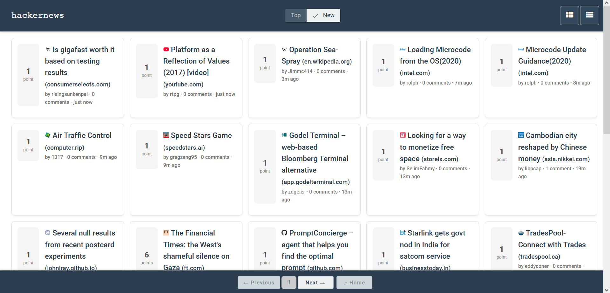
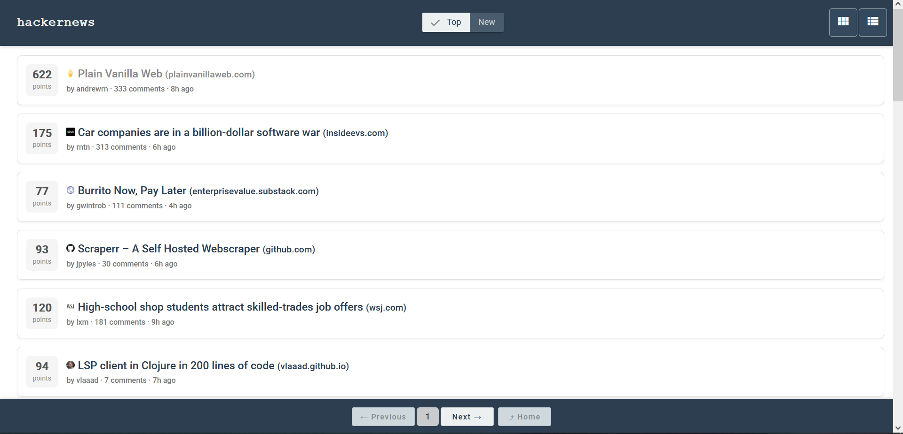
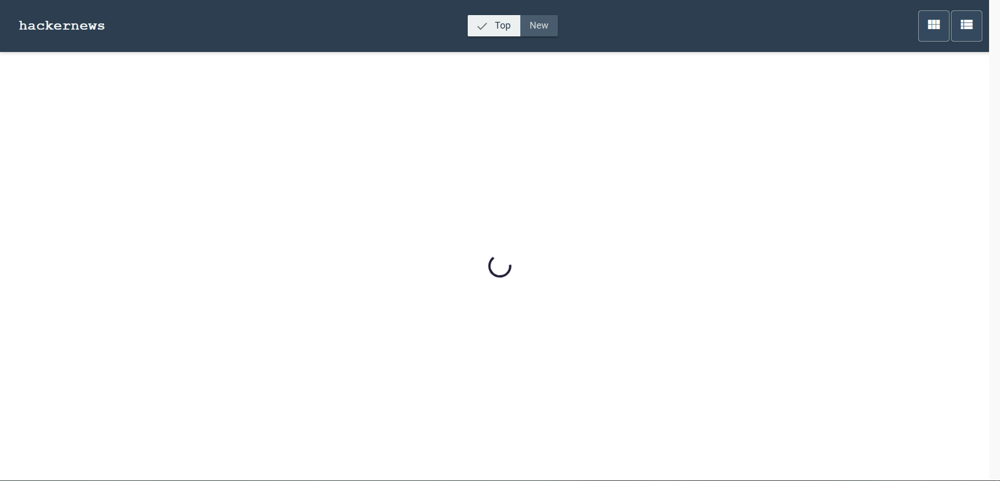
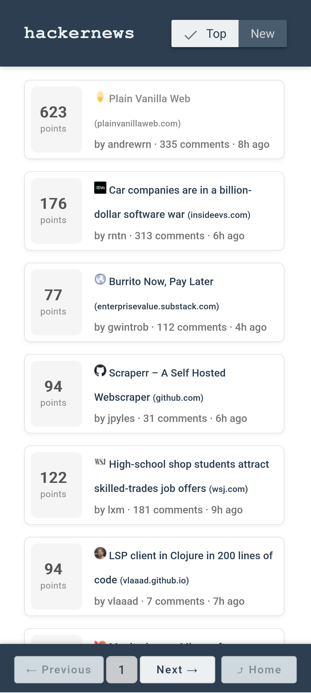
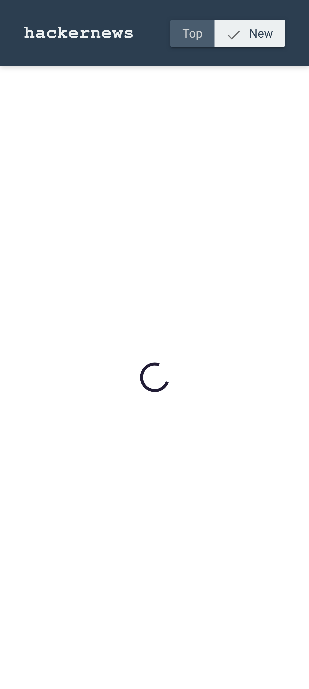
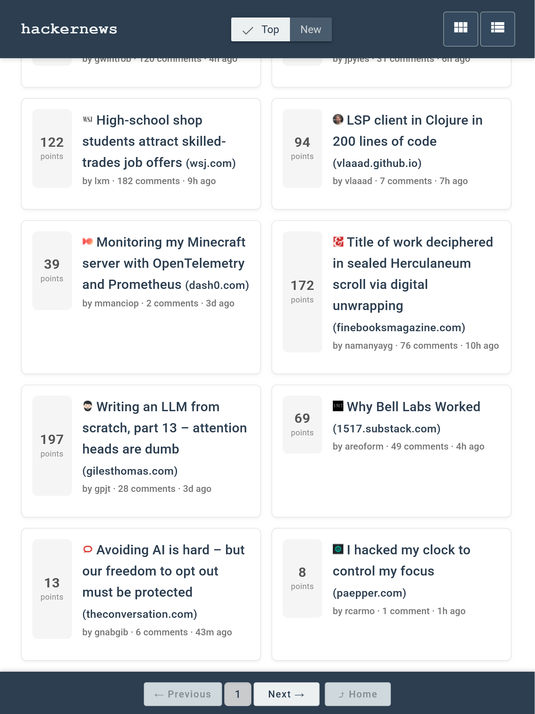
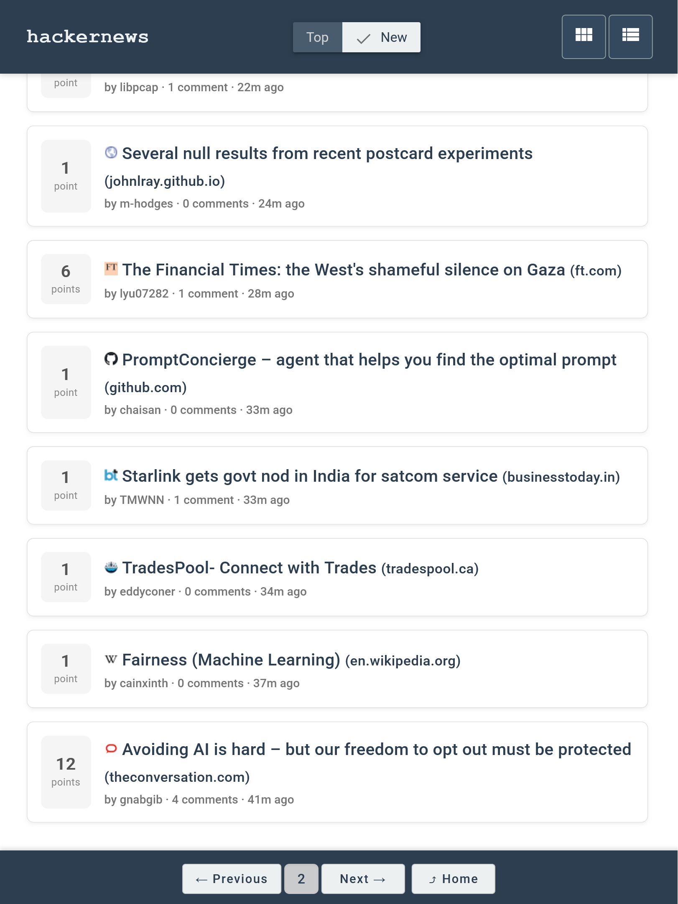
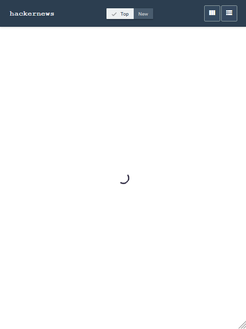

# Hacker News v3.0

A modern Angular redesign of the [Hacker News](https://news.ycombinator.com/) front page using the official [HackerNews API](https://github.com/HackerNews/API). The app is optimized for a clean user experience, responsive layout, and developer best practices.

## Features

- Browse **Top** and **New** stories
- Toggle between **Grid** and **List** views
- Fully **responsive layout**, optimized for mobile and desktop
- Client-side **pagination** with sticky controls
- Rich unit and e2e test coverage
- Minimal, accessible UI with clear visual hierarchy

---

## Getting Started

### Prerequisites

- Node.js (v18+ recommended)
- Angular CLI (`npm install -g @angular/cli`)

### Install

```bash
npm install
```

### Run the App

```bash
npm start
```

Navigate to `http://localhost:4200` in your browser.

---

## Testing

### Unit Tests

```bash
npm run test
```

Runs Jasmine/Karma tests with live reload.

### End-to-End (E2E) with Playwright

```bash
npm run e2e
```

Playwright tests simulate UI flows like view toggling, pagination, and responsive behavior.

---

## Scripts

| Script        | Description                            |
|---------------|----------------------------------------|
| `npm start`   | Run the dev server                     |
| `npm run test`| Execute unit tests                     |
| `npm run e2e` | Run Playwright e2e tests               |
| `npm run lint`| Lint TS/HTML via Angular ESLint        |
| `npm run lint:css`     | Lint all SCSS with Stylelint   |
| `npm run lint:css:fix` | Auto-fix SCSS lint issues       |

---

## Tech Stack

- **Angular 19**
- **Angular Material** (CDK UI components)
- **RxJS** for reactive data handling
- **Playwright** for E2E testing
- **Stylelint** + **Angular ESLint** for static analysis
- SCSS for styling with mobile-first media queries

---

## Test Coverage

```txt
Statements   : 86.3% ( 189/219 )
Branches     : 84.05% ( 58/69 )
Functions    : 82.69% ( 43/52 )
Lines        : 87.61% ( 184/210 )
```

> Code is type-safe and linted across TS/HTML/SCSS.

---

## Future Work

- Add Reddit-style thumbnail or link preview for stories
- Add light/dark mode toggle
- Add comments view per story
- Add user profile views (`/user/:id`)
- Mock API for E2E tests (for offline/CI reliability)
- Add sorting & filtering (by score, time)
- Improve accessibility & keyboard navigation

---

## Project Structure 

```
src/
├── app/
│   ├── components/    # Reusable UI blocks (Navbar, PaginationBar, StoryItem, etc.)
│   ├── pages/         # Main HomeComponent page
│   ├── services/      # StoryService (API logic)
│   ├── utils/         # Helper functions (e.g., getTimeAgo)
│   └── styles/        # Shared styles and theming
```

---

## Assumptions

- Only **Top** and **New** stories were required for this take-home.
- Pagination is handled entirely client-side after fetching all IDs.
- Only essential data fields (title, score, time, author) are shown in story cards (similar to the original Hacker News).
    - User and comment links redirect to their counterparts on the live Hacker News site.
- Fallbacks are in place if a story has no URL or the API fails.

---

## Notes

- Built with accessibility, responsiveness, and extensibility in mind.
- Fully typed (`no-explicit-any`), clean CSS.
- Designed to be developer-friendly and easy to evolve.

---

## UI Screenshots

### Desktop View

- **Grid Layout**  
  

- **List Layout**  
  

- **Loading State**  
  

### Mobile (Galaxy S20)

- **Layout**  
  

- **Loading State**  
  

### Tablet (iPad)

- **Grid Layout**  
  

- **List Layout**  
  

- **Loading State**  
  
